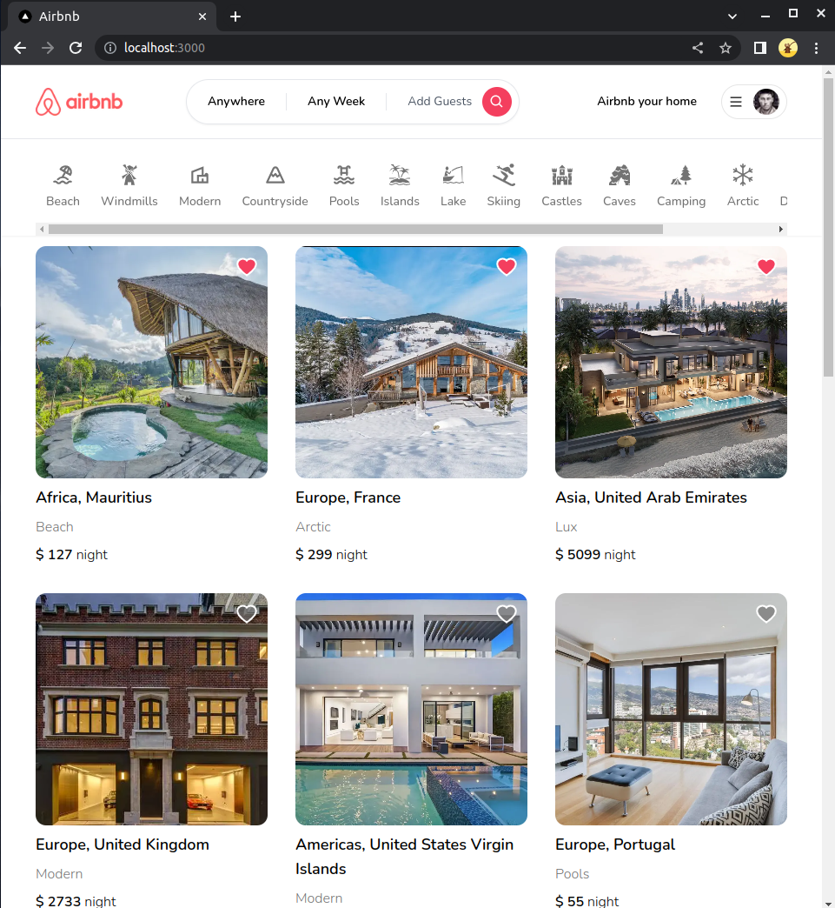
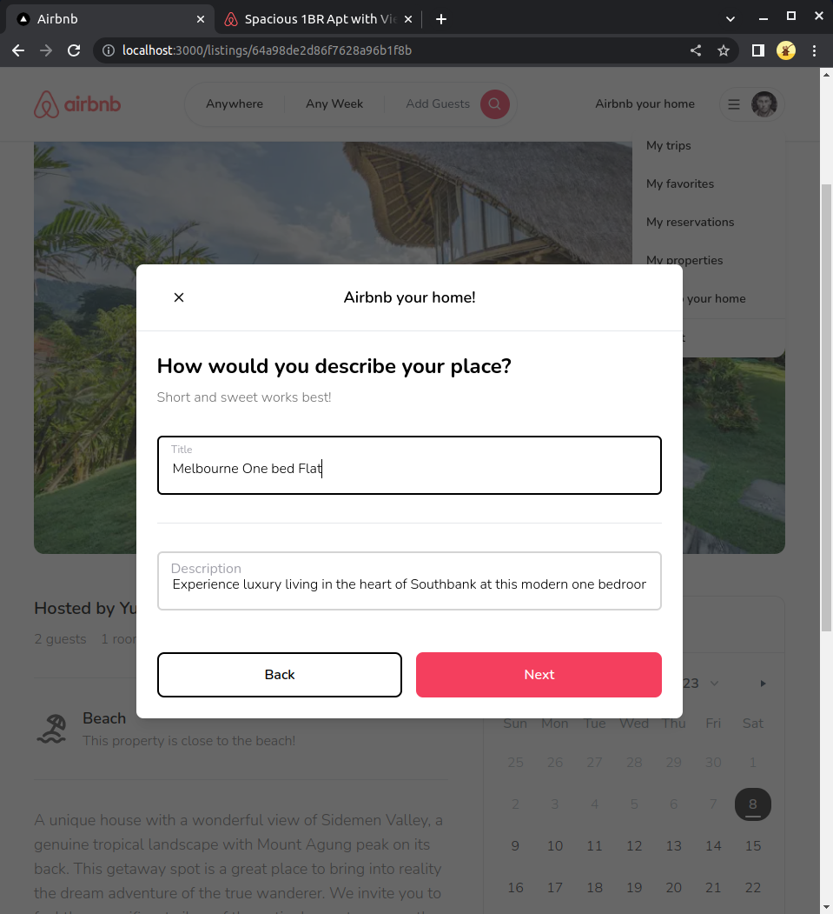

# Full Stack Airbnb Clone with Next.js 13 App Router: React, Tailwind, Prisma, MongoDB, NextAuth


## Introduction

Aim: Develop a Full Stack Airbnb Clone with Next.js 13 App Router

## Technology Used
- React
- Tailwind 
- Prisma
- MongoDB
- NextAuth
- TSX | Typescript | Javascript 
- CSS
- Cloudinary 
- Google Cloud Console | APIs & Services

## Features
- Full responsiveness (on all devices and screen sizes)

Tablet          |  Mobile
:-------------------------:|:-------------------------:
  |  

- Rental Property Information Page and Favourites Page

Property Information          |  Favourites
:-------------------------:|:-------------------------:
  |  

- Add your own Rental Property

Airbnb your Home         |  Enter location      
:-------------------------:|:-------------------------:
  |   

Enter Amenities       |  Enter Description     
:-------------------------:|:-------------------------:
  |   

Upload Images    |  Confirm upload    
:-------------------------:|:-------------------------:
  |   

Set Price    |  Owners can manage property listings  
:-------------------------:|:-------------------------:
  |   

View and Cancel guest reservatuons    |  Favourite owned properties
:-------------------------:|:-------------------------:
   |   


- Rent a Property

Filter System          |  Filter by location, date range, and guests      
:-------------------------:|:-------------------------:
  |   

Select Property       |  Select desired dates and reserve     
:-------------------------:|:-------------------------:
  |   

View past and upcoming trips      |  Date validation (date range greyed out if reserved)
:-------------------------:|:-------------------------:
  |   


## Full Features List
- Tailwind design
- Tailwind animations and effects
- Full responsiveness (on all devices)
- Credential authentication
- Google authentication
- Github authentication
- Image upload using Cloudinary CDN
- Client form validation and handling using react-hook-form
- Server error handling using react-toast
- Calendars with react-date-range
- Page loading state
- Page empty state
- Booking / Reservation system
- Guest reservation cancellation
- Owner reservation cancellation
- Creation and deletion of properties
- Pricing calculation
- Advanced search algorithm by category, date range, map location, number of guests, rooms and bathrooms
    - filter out properties that have a reservation in your desired date range to travel
- Favorites system
- Shareable URL filters
- POST and DELETE routes in route handlers (app/api)
- Fetch data in server react components by directly accessing database without API
- Handle error.tsx and loading.tsx  Next 13 templating files to unify loading and error handling

## Prerequisites

- Node version 14 to Node version 20

- React version 18

## Cloning the Repository

```shell
git clone https://github.com/
```

## Install packages

```shell
npm i
```

## MongoDB Set Up

- MongoDB Atlas 
- Build a Database
- Create a User
- Add IP address or 0.0.0.0/0 if you have a Dynamic IP Address
- Connect to Cluster using VS Code
- Copy DATABASE_URL

## GITHUB Set Up

- Developer Settings
- OAuth Application Settings
- Set Homepage URL as localhost:3000
- Copy GITHUB_ID and GITHUB_SECRET

## Set Up Google Developer Console

- Create a New Project
- Navigate to Enabled API and Services
- OAuth Consent Screen
- Set User Type to External
- Credentials: Set AUthorised Redirect URL to:
```shell
http://localhost:3000/api/auth/callback/google
```
- Copy GOOGLE_CLIENT_ID and GOOGLE_CLIENT_SECRET

## Cloudinary Set Up
- Dashboard
- Copy Public Cloudinary Name
```shell
npm install next-cloudinary
```
## Prisma Set Up

```shell
npx prisma init
```
Set Prisma Schema providers

```tsx
//schema.prisma
generator client {
  provider = "prisma-client-js"
}
datasource db {
  provider = "mongodb"
  url      = env("DATABASE_URL")
}
```

```shell
npx prisma db push

```
Database indexes are now in sync with Prisma Schema

## Setup .env File

Copy Credentials into .env file

```js
DATABASE_URL=
GOOGLE_CLIENT_ID=
GOOGLE_CLIENT_SECRET=
GITHUB_ID=
GITHUB_SECRET=
NEXTAUTH_SECRET=
```
## Compile and Run The App

```shell
npm run dev
```

Running commands with npm `npm run [command]`

| command         | description                              |
| :-------------- | :--------------------------------------- |
| `dev`           | Starts a development instance of the app |
| `lint`          | Checks code for errors and warnings |

## Deployment 

- Push Repository to Github
- https://vercel.com/
- Import from GitHub
- Enter .env variables
- Deploy
